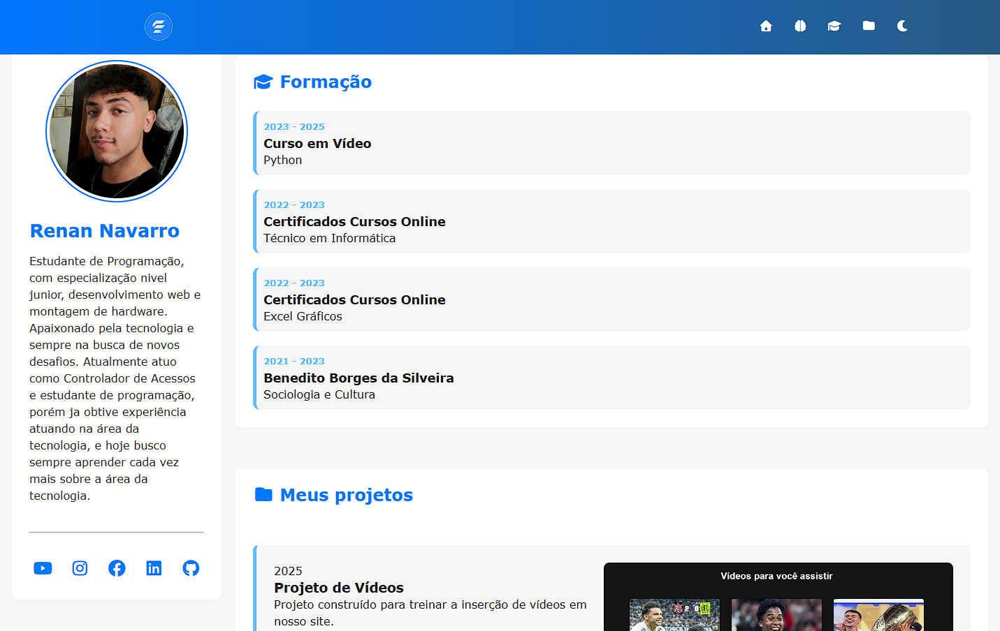

Projeto final do Curso em Vídeo de HTML e CSS

# ✨ Portfólio Front-End Developer

<p align="center">
  
  
  
</p>

---

## 📖 Sobre o Projeto

Este é meu portfólio pessoal desenvolvido do zero com foco em:

- Design moderno
- Interface responsiva
- Animações suaves
- Performance
- Experiência do usuário

O projeto foi criado para apresentar minhas habilidades como desenvolvedor Front-End e reunir meus principais projetos em um só lugar.

---

## 🚀 Demonstração

🔗 Acesse o projeto online:

👉 https://renannavarro016.github.io/projeto-portfolio/

---

## 🖼️ Preview



---

## ⚙️ Tecnologias Utilizadas

<div style="display: inline_block"><br>


</div>

---

## ✨ Funcionalidades

✅ Layout moderno  
✅ Responsividade para dispositivos móveis  
✅ Navbar fixa  
✅ Scroll suave  
✅ Efeitos de hover  
✅ Animações na página  
✅ Seção de projetos  
✅ Links para redes sociais  

---

## 📱 Responsividade

O site foi desenvolvido para funcionar perfeitamente em:

- 💻 Desktop
- 📱 Smartphones
- 📲 Tablets

---

## 📂 Estrutura do Projeto

```bash
📦 projeto-portfolio
 ┣ 📂 assets
 ┃ ┣ 📂 css
 ┃ ┣ 📂 js
 ┃ ┗ 📂 img
 ┣ 📜 index.html
 ┗ 📜 README.md